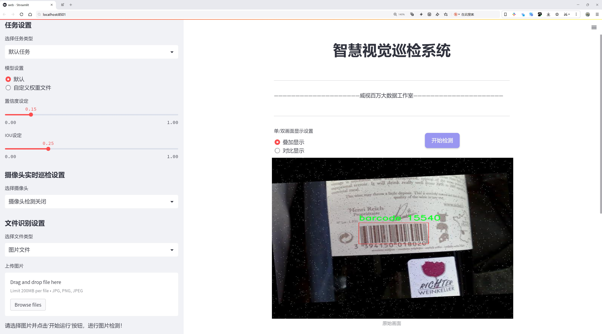
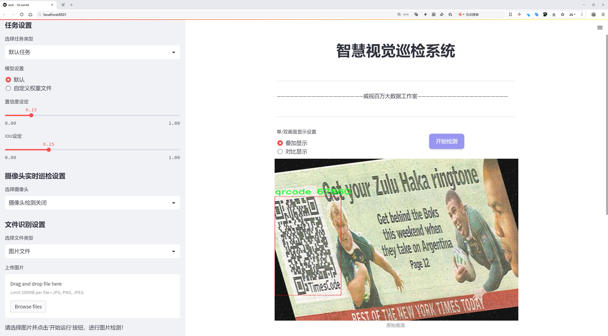
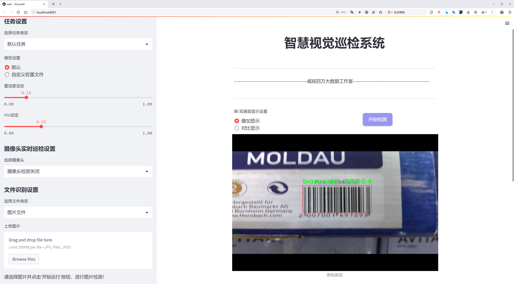
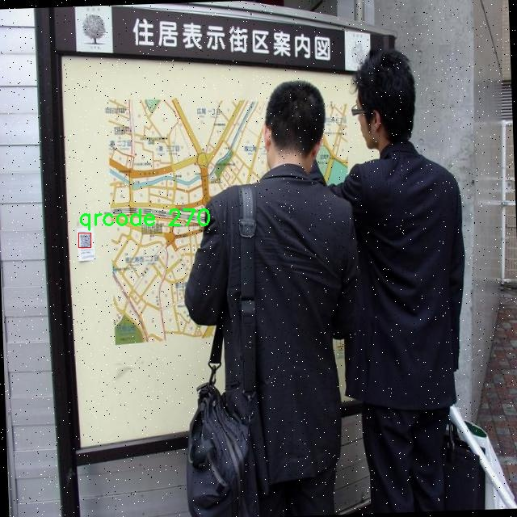
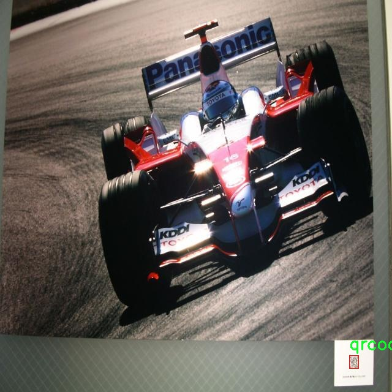
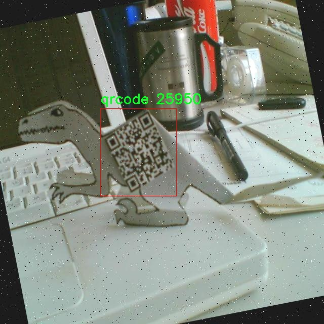
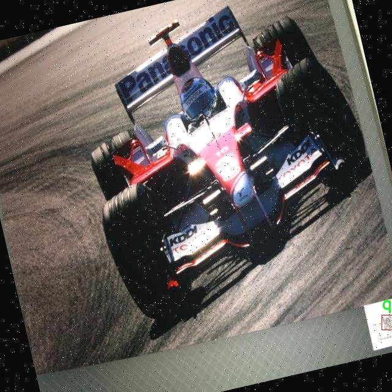

# 二维码与条形码检测检测系统源码分享
 # [一条龙教学YOLOV8标注好的数据集一键训练_70+全套改进创新点发刊_Web前端展示]

### 1.研究背景与意义

项目参考[AAAI Association for the Advancement of Artificial Intelligence](https://gitee.com/qunmasj/projects)

项目来源[AACV Association for the Advancement of Computer Vision](https://kdocs.cn/l/cszuIiCKVNis)

研究背景与意义

随着信息技术的迅猛发展，二维码和条形码作为重要的信息载体，广泛应用于商品追踪、支付系统、物流管理等多个领域。它们不仅提高了信息传递的效率，还在现代商业中扮演着不可或缺的角色。然而，随着应用场景的多样化和环境条件的复杂化，传统的二维码和条形码检测方法面临着诸多挑战，如光照变化、遮挡、模糊等因素对识别准确率的影响。因此，开发一种高效、准确的二维码与条形码检测系统显得尤为重要。

在此背景下，基于改进YOLOv8的二维码与条形码检测系统应运而生。YOLO（You Only Look Once）系列模型因其实时性和高准确率而受到广泛关注。YOLOv8作为该系列的最新版本，进一步优化了模型的结构和算法，提升了目标检测的性能。通过对YOLOv8进行改进，我们可以更好地适应二维码和条形码在不同环境下的检测需求，从而提高系统的鲁棒性和准确性。

本研究所使用的数据集“qrcode_barcode_selected”包含2800张图像，涵盖了二维码和条形码两大类。这一数据集的构建为模型的训练和验证提供了坚实的基础。通过对这2800张图像的深入分析，我们可以提取出二维码和条形码在不同场景下的特征，从而为改进YOLOv8模型提供必要的支持。数据集中包含的多样化样本，使得模型能够学习到更为丰富的特征表达，从而在实际应用中表现出更高的准确率和更强的适应性。

本研究的意义不仅在于提升二维码和条形码的检测效率，更在于推动计算机视觉技术在实际应用中的发展。通过对YOLOv8的改进，我们可以为相关领域提供一种新的解决方案，助力于智能零售、智能物流等行业的数字化转型。此外，二维码和条形码的检测系统在安全监控、智能交通等领域也具有广泛的应用前景。通过提高检测的准确性和实时性，我们能够有效提升这些领域的工作效率和安全性。

综上所述，基于改进YOLOv8的二维码与条形码检测系统的研究，不仅具有重要的理论价值，也具有显著的实际应用意义。随着社会对智能化、自动化需求的不断增加，二维码和条形码检测技术的研究将为推动相关行业的发展提供强有力的技术支持。通过本研究，我们希望能够为未来的研究者提供新的思路和方法，进一步推动计算机视觉领域的进步。

### 2.图片演示







##### 注意：由于此博客编辑较早，上面“2.图片演示”和“3.视频演示”展示的系统图片或者视频可能为老版本，新版本在老版本的基础上升级如下：（实际效果以升级的新版本为准）

  （1）适配了YOLOV8的“目标检测”模型和“实例分割”模型，通过加载相应的权重（.pt）文件即可自适应加载模型。

  （2）支持“图片识别”、“视频识别”、“摄像头实时识别”三种识别模式。

  （3）支持“图片识别”、“视频识别”、“摄像头实时识别”三种识别结果保存导出，解决手动导出（容易卡顿出现爆内存）存在的问题，识别完自动保存结果并导出到tempDir中。

  （4）支持Web前端系统中的标题、背景图等自定义修改，后面提供修改教程。

  另外本项目提供训练的数据集和训练教程,暂不提供权重文件（best.pt）,需要您按照教程进行训练后实现图片演示和Web前端界面演示的效果。

### 3.视频演示

[3.1 视频演示](https://www.bilibili.com/video/BV1CYsbegEFX/)

### 4.数据集信息展示

##### 4.1 本项目数据集详细数据（类别数＆类别名）

nc: 2
names: ['barcode', 'qrcode']


##### 4.2 本项目数据集信息介绍

数据集信息展示

在本研究中，我们使用了名为“qrcode_barcode_selected”的数据集，旨在改进YOLOv8模型在二维码与条形码检测方面的性能。该数据集的设计考虑了实际应用中的多样性与复杂性，包含了两种主要类别：条形码（barcode）和二维码（qrcode）。这两种类别在现代商业、物流、以及信息传递中扮演着至关重要的角色，因此，准确高效地检测和识别它们是提升自动化系统性能的关键。

“qrcode_barcode_selected”数据集的类别数量为2，分别是条形码和二维码。条形码通常由一系列平行的黑白条纹组成，能够存储数字和字母信息，广泛应用于商品标识、库存管理等领域。而二维码则是由黑色模块组成的方形图案，能够存储更多的信息，包括网址、文本、联系方式等，因其高信息密度和快速扫描的特性，广泛应用于移动支付、票务、身份验证等场景。

为了确保数据集的有效性和实用性，我们在数据收集过程中采取了多种策略。首先，数据集中的图像来源于不同的环境和条件，包括自然光照、人工光源、不同的背景以及各种角度的拍摄。这种多样性使得模型在训练过程中能够学习到不同的特征，从而提高其在实际应用中的鲁棒性。此外，为了增强数据集的丰富性，我们还对图像进行了多种数据增强处理，如旋转、缩放、剪裁和颜色变换等，以模拟不同的使用场景和设备条件。

数据集中的每一张图像都经过精确的标注，确保每个条形码和二维码的边界框都准确无误。这种高质量的标注不仅有助于模型的训练，也为后续的评估提供了可靠的基准。我们还对数据集进行了划分，确保训练集、验证集和测试集的比例合理，以便于模型的训练和性能评估。

在模型训练过程中，我们将使用YOLOv8这一先进的目标检测算法。YOLOv8以其高效的检测速度和准确性而闻名，特别适合实时应用场景。通过使用“qrcode_barcode_selected”数据集，我们期望能够进一步优化YOLOv8在二维码和条形码检测中的表现，提升其在复杂环境下的检测能力。

综上所述，“qrcode_barcode_selected”数据集为本研究提供了坚实的基础。通过精心设计的类别和多样化的图像样本，我们相信该数据集将有效支持YOLOv8模型的训练与优化，推动二维码与条形码检测技术的发展，最终实现更高效的自动化应用。










### 5.全套项目环境部署视频教程（零基础手把手教学）

[5.1 环境部署教程链接（零基础手把手教学）](https://www.ixigua.com/7404473917358506534?logTag=c807d0cbc21c0ef59de5)


[5.2 安装Python虚拟环境创建和依赖库安装视频教程链接（零基础手把手教学）](https://www.ixigua.com/7404474678003106304?logTag=1f1041108cd1f708b01a)

### 6.手把手YOLOV8训练视频教程（零基础小白有手就能学会）

[6.1 手把手YOLOV8训练视频教程（零基础小白有手就能学会）](https://www.ixigua.com/7404477157818401292?logTag=d31a2dfd1983c9668658)

### 7.70+种全套YOLOV8创新点代码加载调参视频教程（一键加载写好的改进模型的配置文件）

[7.1 70+种全套YOLOV8创新点代码加载调参视频教程（一键加载写好的改进模型的配置文件）](https://www.ixigua.com/7404478314661806627?logTag=29066f8288e3f4eea3a4)

### 8.70+种全套YOLOV8创新点原理讲解（非科班也可以轻松写刊发刊，V10版本正在科研待更新）

由于篇幅限制，每个创新点的具体原理讲解就不一一展开，具体见下列网址中的创新点对应子项目的技术原理博客网址【Blog】：


[8.1 70+种全套YOLOV8创新点原理讲解链接](https://gitee.com/qunmasj/good)

### 9.系统功能展示（检测对象为举例，实际内容以本项目数据集为准）

图9.1.系统支持检测结果表格显示

  图9.2.系统支持置信度和IOU阈值手动调节

  图9.3.系统支持自定义加载权重文件best.pt(需要你通过步骤5中训练获得)

  图9.4.系统支持摄像头实时识别

  图9.5.系统支持图片识别

  图9.6.系统支持视频识别

  图9.7.系统支持识别结果文件自动保存

  图9.8.系统支持Excel导出检测结果数据


### 10.原始YOLOV8算法原理

原始YOLOv8算法原理

YOLOv8是由Ultralytics团队在2023年1月推出的目标检测模型，它在YOLOv5的基础上进行了多项重要改进，旨在提升模型的性能和灵活性。YOLOv8的设计理念强调快速、准确和易于使用，使其在广泛的目标检测、图像分割和图像分类任务中表现出色。该模型不仅在结构上进行了优化，还在训练策略和数据增强方面进行了创新，以提高其鲁棒性和泛化能力。

YOLOv8的网络结构主要由三个部分组成：Backbone、Neck和Head。Backbone负责特征提取，Neck用于特征融合，而Head则进行最终的目标检测。以YOLOv8n为例，其输入图像的默认尺寸为640x640。在实际应用中，YOLOv8采用自适应图片缩放策略，能够根据输入图像的长宽比进行调整，减少信息冗余，从而提高检测速度和准确性。在训练过程中，YOLOv8使用Mosaic数据增强技术，通过将四张不同的图像拼接成一张新图像，迫使模型学习不同位置和周围像素的特征，显著提升了模型的预测精度。

在Backbone部分，YOLOv8对主干网络进行了重要改进，主要是将YOLOv5中的C3模块替换为C2f模块。C2f模块借鉴了YOLOv7中的ELAN设计理念，通过引入更多的跳层连接，增强了梯度流信息的传递。这种结构不仅提高了特征提取的效率，还在保证模型轻量化的同时，提升了检测精度。此外，YOLOv8依然保留了快速空间金字塔池化（SPPF）结构，进一步提高了特征提取的速度和效果。

在Neck部分，YOLOv8同样对结构进行了优化，将所有的C3模块更改为C2f模块，并删除了两处上采样之前的卷积连接层。这一改动使得特征融合过程更加高效，直接将Backbone不同阶段输出的特征进行上采样，减少了计算复杂度，提高了整体的推理速度。

YOLOv8的Head部分是其结构变化最大的地方。与YOLOv5的Coupled-Head（耦合头）不同，YOLOv8采用了Decoupled-Head（解耦头）结构。具体而言，YOLOv8将检测和分类任务分为两个独立的分支，分别提取类别和位置特征。这种解耦设计使得模型在处理分类和定位任务时能够更加专注，从而提高了收敛速度和预测精度。此外，YOLOv8摒弃了传统的Anchor-Based（基于锚框）方法，转而采用Anchor-Free（无锚框）策略。通过直接预测目标的中心点和宽高比例，YOLOv8显著减少了计算复杂度，并提高了检测的灵活性和准确性。

在损失函数的设计上，YOLOv8引入了任务对齐学习（Task Alignment Learning，TAL）机制，以更好地平衡分类和定位任务的损失。具体而言，YOLOv8在分类分支中使用二值交叉熵损失（BCELoss），而在边界框回归分支中则采用分布焦点损失（DFL）和CIoU损失的组合。这种设计使得模型能够快速聚焦于标签附近的数值，从而提高了检测的精度。

在模型性能方面，YOLOv8在COCO数据集上的表现令人瞩目。通过与YOLO系列的其他模型进行比较，YOLOv8在相同尺寸下实现了更高的精度和更快的推理速度，且模型参数的增加并不显著。这使得YOLOv8在实时性和准确性兼顾的任务中，尤其是在垃圾目标检测等应用场景中，展现出极大的潜力。

总的来说，YOLOv8在原有YOLO系列模型的基础上，通过引入新的模块、优化网络结构和改进训练策略，显著提升了目标检测的性能。其高效的特征提取和目标检测方式，使得YOLOv8成为当前目标检测领域中一个极具竞争力的选择。随着YOLOv8的广泛应用，未来在各种实际场景中的表现值得期待。


### 11.项目核心源码讲解（再也不用担心看不懂代码逻辑）

#### 11.1 code\ultralytics\models\yolo\segment\train.py

以下是对代码的核心部分进行提炼和详细注释的结果：

```python
# 引入必要的库和模块
from copy import copy
from ultralytics.models import yolo
from ultralytics.nn.tasks import SegmentationModel
from ultralytics.utils import DEFAULT_CFG, RANK
from ultralytics.utils.plotting import plot_images, plot_results

class SegmentationTrainer(yolo.detect.DetectionTrainer):
    """
    SegmentationTrainer类扩展了DetectionTrainer类，用于基于分割模型的训练。
    
    示例用法：
        ```python
        from ultralytics.models.yolo.segment import SegmentationTrainer

        args = dict(model='yolov8n-seg.pt', data='coco8-seg.yaml', epochs=3)
        trainer = SegmentationTrainer(overrides=args)
        trainer.train()
        ```
    """

    def __init__(self, cfg=DEFAULT_CFG, overrides=None, _callbacks=None):
        """初始化SegmentationTrainer对象，接受配置和重写参数。"""
        if overrides is None:
            overrides = {}
        overrides["task"] = "segment"  # 设置任务类型为分割
        super().__init__(cfg, overrides, _callbacks)  # 调用父类构造函数

    def get_model(self, cfg=None, weights=None, verbose=True):
        """返回初始化的SegmentationModel，使用指定的配置和权重。"""
        # 创建SegmentationModel实例，设置输入通道数为3，类别数为数据集中类别数
        model = SegmentationModel(cfg, ch=3, nc=self.data["nc"], verbose=verbose and RANK == -1)
        if weights:
            model.load(weights)  # 如果提供了权重，则加载权重

        return model  # 返回模型实例

    def get_validator(self):
        """返回SegmentationValidator实例，用于YOLO模型的验证。"""
        self.loss_names = "box_loss", "seg_loss", "cls_loss", "dfl_loss"  # 定义损失名称
        return yolo.segment.SegmentationValidator(
            self.test_loader, save_dir=self.save_dir, args=copy(self.args), _callbacks=self.callbacks
        )  # 返回验证器实例

    def plot_training_samples(self, batch, ni):
        """创建训练样本图像的绘图，包括标签和边框坐标。"""
        plot_images(
            batch["img"],  # 输入图像
            batch["batch_idx"],  # 批次索引
            batch["cls"].squeeze(-1),  # 类别标签
            batch["bboxes"],  # 边框坐标
            masks=batch["masks"],  # 分割掩码
            paths=batch["im_file"],  # 图像文件路径
            fname=self.save_dir / f"train_batch{ni}.jpg",  # 保存文件名
            on_plot=self.on_plot,  # 绘图回调
        )

    def plot_metrics(self):
        """绘制训练和验证指标。"""
        plot_results(file=self.csv, segment=True, on_plot=self.on_plot)  # 保存结果为results.png
```

### 代码核心部分分析：
1. **类定义**：`SegmentationTrainer`类是用于分割任务的训练器，继承自YOLO的检测训练器。
2. **初始化方法**：在初始化时设置任务类型为分割，并调用父类的初始化方法。
3. **模型获取**：`get_model`方法用于创建和返回分割模型实例，可以选择性地加载预训练权重。
4. **验证器获取**：`get_validator`方法返回一个用于验证的分割验证器实例，并定义了损失名称。
5. **绘图方法**：`plot_training_samples`和`plot_metrics`方法用于可视化训练样本和训练指标，帮助分析模型的训练过程。

这些核心部分和注释提供了对分割训练器的基本理解和使用方法。

这个文件是一个用于训练YOLO（You Only Look Once）模型进行图像分割的Python脚本，主要定义了一个名为`SegmentationTrainer`的类。该类继承自`DetectionTrainer`，专门用于处理图像分割任务。

在类的初始化方法`__init__`中，首先设置了一些默认参数。如果没有提供`overrides`参数，则创建一个空字典，并将任务类型设置为“segment”，然后调用父类的初始化方法，传递配置、覆盖参数和回调函数。

`get_model`方法用于返回一个初始化的分割模型`SegmentationModel`，它接受配置和权重参数。如果提供了权重，则会加载这些权重。这个方法的目的是根据给定的配置创建一个适合于分割任务的模型。

`get_validator`方法返回一个`SegmentationValidator`实例，用于验证YOLO模型的性能。在这个方法中，定义了损失名称，包括边界框损失、分割损失、分类损失和分布式焦点损失。返回的验证器会使用测试数据加载器和保存目录，并将当前参数和回调函数传递给它。

`plot_training_samples`方法用于生成训练样本的可视化图像，展示图像、标签和边界框坐标。它使用`plot_images`函数来创建图像，并将结果保存到指定的文件中。

最后，`plot_metrics`方法用于绘制训练和验证过程中的指标。它调用`plot_results`函数，将结果保存为图像文件，以便于后续分析和可视化。

总体来说，这个文件的主要功能是为YOLO模型的图像分割任务提供训练和验证的框架，包含了模型的初始化、训练样本的可视化以及性能指标的绘制等功能。

#### 11.2 70+种YOLOv8算法改进源码大全和调试加载训练教程（非必要）\ultralytics\trackers\utils\kalman_filter.py

以下是经过简化并添加详细中文注释的核心代码部分：

```python
import numpy as np
import scipy.linalg

class KalmanFilterXYAH:
    """
    Kalman滤波器，用于在图像空间中跟踪边界框。
    状态空间为8维，包括中心位置(x, y)、宽高比a、高度h及其速度。
    运动模型为恒速模型。
    """

    def __init__(self):
        """初始化Kalman滤波器的模型矩阵，设置运动和观测的不确定性权重。"""
        ndim, dt = 4, 1.  # 状态维度和时间步长

        # 创建Kalman滤波器模型矩阵
        self._motion_mat = np.eye(2 * ndim, 2 * ndim)  # 运动矩阵
        for i in range(ndim):
            self._motion_mat[i, ndim + i] = dt  # 设置速度部分
        self._update_mat = np.eye(ndim, 2 * ndim)  # 更新矩阵

        # 运动和观测的不确定性权重
        self._std_weight_position = 1. / 20
        self._std_weight_velocity = 1. / 160

    def initiate(self, measurement):
        """
        从未关联的测量创建跟踪。

        参数
        ----------
        measurement : ndarray
            边界框坐标 (x, y, a, h)

        返回
        -------
        (ndarray, ndarray)
            返回新的跟踪的均值向量和协方差矩阵。
        """
        mean_pos = measurement  # 初始位置
        mean_vel = np.zeros_like(mean_pos)  # 初始速度为0
        mean = np.r_[mean_pos, mean_vel]  # 合并位置和速度

        # 初始化协方差矩阵
        std = [
            2 * self._std_weight_position * measurement[3],  # y方向位置不确定性
            2 * self._std_weight_position * measurement[3],  # x方向位置不确定性
            1e-2,  # 宽高比不确定性
            2 * self._std_weight_position * measurement[3],  # 高度不确定性
            10 * self._std_weight_velocity * measurement[3],  # y方向速度不确定性
            10 * self._std_weight_velocity * measurement[3],  # x方向速度不确定性
            1e-5,  # 宽高比速度不确定性
            10 * self._std_weight_velocity * measurement[3]   # 高度速度不确定性
        ]
        covariance = np.diag(np.square(std))  # 协方差矩阵为对角矩阵
        return mean, covariance

    def predict(self, mean, covariance):
        """
        运行Kalman滤波器预测步骤。

        参数
        ----------
        mean : ndarray
            上一时间步的状态均值向量。
        covariance : ndarray
            上一时间步的状态协方差矩阵。

        返回
        -------
        (ndarray, ndarray)
            返回预测状态的均值向量和协方差矩阵。
        """
        # 计算运动协方差
        std_pos = [
            self._std_weight_position * mean[3],  # y方向位置不确定性
            self._std_weight_position * mean[3],  # x方向位置不确定性
            1e-2,  # 宽高比不确定性
            self._std_weight_position * mean[3]   # 高度不确定性
        ]
        std_vel = [
            self._std_weight_velocity * mean[3],  # y方向速度不确定性
            self._std_weight_velocity * mean[3],  # x方向速度不确定性
            1e-5,  # 宽高比速度不确定性
            self._std_weight_velocity * mean[3]   # 高度速度不确定性
        ]
        motion_cov = np.diag(np.square(np.r_[std_pos, std_vel]))  # 运动协方差矩阵

        # 预测均值和协方差
        mean = np.dot(mean, self._motion_mat.T)  # 更新均值
        covariance = np.linalg.multi_dot((self._motion_mat, covariance, self._motion_mat.T)) + motion_cov  # 更新协方差

        return mean, covariance

    def update(self, mean, covariance, measurement):
        """
        运行Kalman滤波器校正步骤。

        参数
        ----------
        mean : ndarray
            预测状态的均值向量。
        covariance : ndarray
            状态的协方差矩阵。
        measurement : ndarray
            测量向量 (x, y, a, h)。

        返回
        -------
        (ndarray, ndarray)
            返回测量校正后的状态分布。
        """
        # 投影到测量空间
        projected_mean, projected_cov = self.project(mean, covariance)

        # 计算卡尔曼增益
        chol_factor, lower = scipy.linalg.cho_factor(projected_cov, lower=True, check_finite=False)
        kalman_gain = scipy.linalg.cho_solve((chol_factor, lower),
                                             np.dot(covariance, self._update_mat.T).T,
                                             check_finite=False).T
        innovation = measurement - projected_mean  # 计算创新

        # 更新均值和协方差
        new_mean = mean + np.dot(innovation, kalman_gain.T)
        new_covariance = covariance - np.linalg.multi_dot((kalman_gain, projected_cov, kalman_gain.T))
        return new_mean, new_covariance
```

### 代码说明
1. **KalmanFilterXYAH 类**：这是一个简单的卡尔曼滤波器，用于跟踪图像空间中的边界框。它的状态空间包括位置、宽高比、高度及其速度。
2. **初始化方法**：设置运动和观测的不确定性权重，并初始化运动矩阵和更新矩阵。
3. **initiate 方法**：根据测量值创建跟踪，返回初始均值和协方差矩阵。
4. **predict 方法**：执行预测步骤，更新均值和协方差矩阵。
5. **update 方法**：执行校正步骤，更新均值和协方差矩阵以反映新的测量值。

这个程序文件实现了一个简单的卡尔曼滤波器，用于在图像空间中跟踪边界框。文件中定义了两个类：`KalmanFilterXYAH`和`KalmanFilterXYWH`，分别用于处理不同形式的边界框表示。

`KalmanFilterXYAH`类用于处理包含中心位置（x, y）、宽高比（a）和高度（h）的边界框。它的状态空间是8维的，包括位置、宽高比、高度及其对应的速度。该类在初始化时创建了运动模型矩阵和观测模型矩阵，并设置了运动和观测的不确定性权重。

在`initiate`方法中，通过传入的测量值（边界框的坐标）来创建一个新的跟踪对象，返回其均值向量和协方差矩阵。`predict`方法用于进行卡尔曼滤波的预测步骤，更新状态的均值和协方差。`project`方法则将状态分布投影到测量空间，返回投影后的均值和协方差。

`multi_predict`方法是预测步骤的向量化版本，能够同时处理多个状态。`update`方法用于执行卡尔曼滤波的校正步骤，根据新的测量值更新状态分布。`gating_distance`方法计算状态分布与测量值之间的距离，帮助判断测量值是否与当前状态匹配。

`KalmanFilterXYWH`类继承自`KalmanFilterXYAH`，主要用于处理包含中心位置（x, y）、宽度（w）和高度（h）的边界框。它重写了`initiate`、`predict`和`project`方法，以适应新的边界框表示。

整体来看，这个文件提供了一个基于卡尔曼滤波的跟踪算法框架，能够在视频监控、目标跟踪等应用中有效地处理和预测目标的位置和运动状态。

#### 11.3 ui.py

以下是代码中最核心的部分，并附上详细的中文注释：

```python
import sys
import subprocess

def run_script(script_path):
    """
    使用当前 Python 环境运行指定的脚本。

    Args:
        script_path (str): 要运行的脚本路径

    Returns:
        None
    """
    # 获取当前 Python 解释器的路径
    python_path = sys.executable

    # 构建运行命令，使用 streamlit 运行指定的脚本
    command = f'"{python_path}" -m streamlit run "{script_path}"'

    # 执行命令，并等待其完成
    result = subprocess.run(command, shell=True)
    
    # 检查命令执行的返回码，如果不为0则表示出错
    if result.returncode != 0:
        print("脚本运行出错。")

# 实例化并运行应用
if __name__ == "__main__":
    # 指定要运行的脚本路径
    script_path = "web.py"  # 假设脚本在当前目录下

    # 调用函数运行脚本
    run_script(script_path)
```

### 代码说明：
1. **导入模块**：
   - `sys`：用于获取当前 Python 解释器的路径。
   - `subprocess`：用于执行外部命令。

2. **`run_script` 函数**：
   - 接收一个参数 `script_path`，表示要运行的 Python 脚本的路径。
   - 使用 `sys.executable` 获取当前 Python 解释器的路径。
   - 构建一个命令字符串，使用 `streamlit` 模块运行指定的脚本。
   - 使用 `subprocess.run` 执行命令，并等待其完成。
   - 检查命令的返回码，如果返回码不为0，表示脚本运行出错，打印错误信息。

3. **主程序块**：
   - 在主程序中，指定要运行的脚本路径（此处假设为 `web.py`）。
   - 调用 `run_script` 函数执行该脚本。

这个程序文件名为 `ui.py`，主要功能是通过当前的 Python 环境运行一个指定的脚本。代码首先导入了必要的模块，包括 `sys`、`os` 和 `subprocess`，以及一个自定义的路径处理函数 `abs_path`。

在 `run_script` 函数中，首先获取当前 Python 解释器的路径，这通过 `sys.executable` 实现。接着，构建一个命令字符串，用于运行指定的脚本 `script_path`，这里使用了 `streamlit` 模块来启动一个 Web 应用。命令的格式是 `"{python_path}" -m streamlit run "{script_path}"`，其中 `python_path` 是当前 Python 解释器的路径，`script_path` 是要运行的脚本路径。

然后，使用 `subprocess.run` 函数执行这个命令。`shell=True` 参数允许在 shell 中执行命令。执行后，程序检查返回的结果码，如果不为零，表示脚本运行出错，并打印相应的错误信息。

在文件的最后部分，使用 `if __name__ == "__main__":` 来确保只有在直接运行该文件时才会执行后面的代码。在这里，首先调用 `abs_path` 函数获取 `web.py` 脚本的绝对路径，然后调用 `run_script` 函数来运行这个脚本。

总体来说，这个程序的目的是为了方便地通过 Python 环境启动一个基于 Streamlit 的 Web 应用，提供了一种简单的方式来运行指定的脚本。

#### 11.4 train.py

以下是经过简化和注释的核心代码部分，主要保留了与YOLO目标检测训练相关的功能：

```python
import random
import numpy as np
import torch.nn as nn
from ultralytics.data import build_dataloader, build_yolo_dataset
from ultralytics.engine.trainer import BaseTrainer
from ultralytics.models import yolo
from ultralytics.nn.tasks import DetectionModel
from ultralytics.utils import LOGGER, RANK
from ultralytics.utils.torch_utils import de_parallel, torch_distributed_zero_first

class DetectionTrainer(BaseTrainer):
    """
    扩展自BaseTrainer类，用于基于检测模型的训练。
    """

    def build_dataset(self, img_path, mode="train", batch=None):
        """
        构建YOLO数据集。

        参数:
            img_path (str): 包含图像的文件夹路径。
            mode (str): 模式，可以是'train'或'val'，用户可以为每种模式自定义不同的增强。
            batch (int, optional): 批次大小，仅用于'rect'模式。默认为None。
        """
        gs = max(int(de_parallel(self.model).stride.max() if self.model else 0), 32)
        return build_yolo_dataset(self.args, img_path, batch, self.data, mode=mode, rect=mode == "val", stride=gs)

    def get_dataloader(self, dataset_path, batch_size=16, rank=0, mode="train"):
        """构造并返回数据加载器。"""
        assert mode in ["train", "val"]
        with torch_distributed_zero_first(rank):  # 仅在DDP中初始化数据集*.cache一次
            dataset = self.build_dataset(dataset_path, mode, batch_size)
        shuffle = mode == "train"  # 训练模式下打乱数据
        workers = self.args.workers if mode == "train" else self.args.workers * 2
        return build_dataloader(dataset, batch_size, workers, shuffle, rank)  # 返回数据加载器

    def preprocess_batch(self, batch):
        """对一批图像进行预处理，包括缩放和转换为浮点数。"""
        batch["img"] = batch["img"].to(self.device, non_blocking=True).float() / 255  # 归一化图像
        if self.args.multi_scale:  # 如果启用多尺度
            imgs = batch["img"]
            sz = (
                random.randrange(self.args.imgsz * 0.5, self.args.imgsz * 1.5 + self.stride)
                // self.stride
                * self.stride
            )  # 随机选择新的尺寸
            sf = sz / max(imgs.shape[2:])  # 计算缩放因子
            if sf != 1:
                ns = [
                    math.ceil(x * sf / self.stride) * self.stride for x in imgs.shape[2:]
                ]  # 计算新的形状
                imgs = nn.functional.interpolate(imgs, size=ns, mode="bilinear", align_corners=False)  # 调整图像大小
            batch["img"] = imgs
        return batch

    def get_model(self, cfg=None, weights=None, verbose=True):
        """返回YOLO检测模型。"""
        model = DetectionModel(cfg, nc=self.data["nc"], verbose=verbose and RANK == -1)
        if weights:
            model.load(weights)  # 加载权重
        return model

    def plot_training_samples(self, batch, ni):
        """绘制带有注释的训练样本。"""
        plot_images(
            images=batch["img"],
            batch_idx=batch["batch_idx"],
            cls=batch["cls"].squeeze(-1),
            bboxes=batch["bboxes"],
            paths=batch["im_file"],
            fname=self.save_dir / f"train_batch{ni}.jpg",
            on_plot=self.on_plot,
        )

    def plot_metrics(self):
        """从CSV文件中绘制指标。"""
        plot_results(file=self.csv, on_plot=self.on_plot)  # 保存结果图
```

### 代码注释说明：
1. **类和方法**：`DetectionTrainer`类继承自`BaseTrainer`，用于YOLO模型的训练。每个方法都有明确的功能，帮助构建数据集、获取数据加载器、预处理图像、获取模型和绘制训练样本等。
2. **数据集构建**：`build_dataset`方法负责构建YOLO数据集，支持训练和验证模式。
3. **数据加载器**：`get_dataloader`方法创建数据加载器，处理数据的批次和工作线程。
4. **图像预处理**：`preprocess_batch`方法将图像归一化并支持多尺度训练。
5. **模型获取**：`get_model`方法返回YOLO检测模型，并可加载预训练权重。
6. **可视化**：`plot_training_samples`和`plot_metrics`方法用于可视化训练样本和训练指标。

这个程序文件 `train.py` 是一个用于训练目标检测模型的代码，主要基于 YOLO（You Only Look Once）架构。代码首先导入了一些必要的库和模块，包括数学运算、随机数生成、深度学习相关的 PyTorch 库，以及 Ultralytics 提供的各种工具和模型。

文件中定义了一个 `DetectionTrainer` 类，该类继承自 `BaseTrainer`，用于实现目标检测模型的训练过程。类的文档字符串提供了一个示例，展示了如何使用该类进行训练。

在 `DetectionTrainer` 类中，定义了多个方法。`build_dataset` 方法用于构建 YOLO 数据集，接受图像路径、模式（训练或验证）和批次大小作为参数。该方法会根据模型的步幅计算最大步幅，并调用 `build_yolo_dataset` 函数来创建数据集。

`get_dataloader` 方法则用于构建并返回数据加载器。它会根据传入的模式（训练或验证）来初始化数据集，并根据需要设置是否打乱数据。这个方法还会根据模式选择合适的工作线程数。

`preprocess_batch` 方法负责对一批图像进行预处理，包括缩放和转换为浮点数格式。它会根据设置的多尺度参数随机选择图像的大小，并对图像进行插值处理，以适应模型的输入要求。

`set_model_attributes` 方法用于设置模型的属性，包括类别数量和类别名称。这个方法确保模型能够正确处理数据集中的类别信息。

`get_model` 方法用于返回一个 YOLO 检测模型，支持加载预训练权重。`get_validator` 方法则返回一个用于模型验证的检测验证器。

`label_loss_items` 方法用于返回带有标签的训练损失项字典，方便在训练过程中跟踪损失情况。`progress_string` 方法生成一个格式化的字符串，用于显示训练进度，包括当前的 epoch、GPU 内存使用情况、损失值、实例数量和图像大小。

`plot_training_samples` 方法用于绘制训练样本及其标注，方便可视化训练过程中的数据。`plot_metrics` 方法从 CSV 文件中绘制训练指标，生成结果图像。最后，`plot_training_labels` 方法用于创建带有标签的训练图，展示数据集中所有的边界框和类别信息。

总体来说，这个文件实现了一个完整的目标检测模型训练流程，包括数据集构建、数据加载、图像预处理、模型设置、损失计算和可视化等功能。

#### 11.5 code\ultralytics\engine\trainer.py

以下是代码中最核心的部分，并附上详细的中文注释：

```python
class BaseTrainer:
    """
    BaseTrainer类是用于训练模型的基类，包含了训练过程中的各个重要步骤和参数设置。
    """

    def __init__(self, cfg=DEFAULT_CFG, overrides=None, _callbacks=None):
        """
        初始化BaseTrainer类。

        参数:
            cfg (str, optional): 配置文件的路径，默认为DEFAULT_CFG。
            overrides (dict, optional): 配置覆盖，默认为None。
        """
        self.args = get_cfg(cfg, overrides)  # 获取配置
        self.check_resume(overrides)  # 检查是否需要从检查点恢复训练
        self.device = select_device(self.args.device, self.args.batch)  # 选择训练设备
        self.validator = None  # 验证器实例
        self.metrics = None  # 训练指标
        self.plots = {}  # 存储绘图数据
        init_seeds(self.args.seed + 1 + RANK, deterministic=self.args.deterministic)  # 初始化随机种子

        # 创建保存结果的目录
        self.save_dir = get_save_dir(self.args)
        self.args.name = self.save_dir.name  # 更新日志名称
        self.wdir = self.save_dir / "weights"  # 权重保存目录
        if RANK in (-1, 0):
            self.wdir.mkdir(parents=True, exist_ok=True)  # 创建目录
            self.args.save_dir = str(self.save_dir)
            yaml_save(self.save_dir / "args.yaml", vars(self.args))  # 保存运行参数
        self.last, self.best = self.wdir / "last.pt", self.wdir / "best.pt"  # 检查点路径
        self.save_period = self.args.save_period  # 保存周期

        self.batch_size = self.args.batch  # 批次大小
        self.epochs = self.args.epochs  # 训练轮数
        self.start_epoch = 0  # 起始轮数
        if RANK == -1:
            print_args(vars(self.args))  # 打印参数

        # 设备设置
        if self.device.type in ("cpu", "mps"):
            self.args.workers = 0  # CPU训练时，工作线程数设置为0

        # 模型和数据集设置
        self.model = check_model_file_from_stem(self.args.model)  # 检查模型文件
        try:
            if self.args.task == "classify":
                self.data = check_cls_dataset(self.args.data)  # 检查分类数据集
            elif self.args.data.split(".")[-1] in ("yaml", "yml") or self.args.task in ("detect", "segment", "pose"):
                self.data = check_det_dataset(self.args.data)  # 检查检测数据集
                if "yaml_file" in self.data:
                    self.args.data = self.data["yaml_file"]  # 更新数据路径
        except Exception as e:
            raise RuntimeError(emojis(f"数据集 '{clean_url(self.args.data)}' 错误 ❌ {e}")) from e

        self.trainset, self.testset = self.get_dataset(self.data)  # 获取训练和测试数据集
        self.ema = None  # 指数移动平均

        # 优化相关初始化
        self.lf = None  # 损失函数
        self.scheduler = None  # 学习率调度器

        # 轮次级别的指标
        self.best_fitness = None  # 最佳适应度
        self.fitness = None  # 当前适应度
        self.loss = None  # 当前损失
        self.tloss = None  # 总损失
        self.loss_names = ["Loss"]  # 损失名称列表
        self.csv = self.save_dir / "results.csv"  # 结果CSV文件路径
        self.plot_idx = [0, 1, 2]  # 绘图索引

        # 回调函数
        self.callbacks = _callbacks or callbacks.get_default_callbacks()  # 获取默认回调
        if RANK in (-1, 0):
            callbacks.add_integration_callbacks(self)  # 添加集成回调

    def train(self):
        """开始训练过程。"""
        # 计算世界大小（即GPU数量）
        if isinstance(self.args.device, str) and len(self.args.device):
            world_size = len(self.args.device.split(","))
        elif isinstance(self.args.device, (tuple, list)):
            world_size = len(self.args.device)
        elif torch.cuda.is_available():
            world_size = 1  # 默认使用设备0
        else:
            world_size = 0  # 使用CPU

        # 如果是分布式训练，运行子进程
        if world_size > 1 and "LOCAL_RANK" not in os.environ:
            cmd, file = generate_ddp_command(world_size, self)  # 生成DDP命令
            try:
                LOGGER.info(f'{colorstr("DDP:")} 调试命令 {" ".join(cmd)}')
                subprocess.run(cmd, check=True)  # 运行命令
            except Exception as e:
                raise e
            finally:
                ddp_cleanup(self, str(file))  # 清理DDP

        else:
            self._do_train(world_size)  # 正常训练

    def _do_train(self, world_size=1):
        """执行训练过程，评估并绘制图形（如果指定）。"""
        if world_size > 1:
            self._setup_ddp(world_size)  # 设置分布式训练
        self._setup_train(world_size)  # 设置训练

        nb = len(self.train_loader)  # 批次数量
        self.run_callbacks("on_train_start")  # 运行训练开始的回调
        LOGGER.info(f'开始训练 {self.epochs} 轮...')

        for epoch in range(self.start_epoch, self.epochs):
            self.epoch = epoch  # 当前轮数
            self.run_callbacks("on_train_epoch_start")  # 运行每轮开始的回调
            self.model.train()  # 设置模型为训练模式
            pbar = enumerate(self.train_loader)  # 训练进度条

            self.optimizer.zero_grad()  # 清空梯度
            for i, batch in pbar:
                self.run_callbacks("on_train_batch_start")  # 运行每批次开始的回调

                # 前向传播
                with torch.cuda.amp.autocast(self.amp):
                    batch = self.preprocess_batch(batch)  # 预处理批次
                    self.loss, self.loss_items = self.model(batch)  # 计算损失
                    self.tloss = (self.tloss * i + self.loss_items) / (i + 1) if self.tloss is not None else self.loss_items  # 更新总损失

                # 反向传播
                self.scaler.scale(self.loss).backward()  # 使用AMP缩放损失并反向传播

                # 优化步骤
                self.optimizer_step()  # 执行优化步骤

                self.run_callbacks("on_train_batch_end")  # 运行每批次结束的回调

            self.run_callbacks("on_train_epoch_end")  # 运行每轮结束的回调

        self.run_callbacks("on_train_end")  # 运行训练结束的回调

    def optimizer_step(self):
        """执行优化器的单步更新，包括梯度裁剪和EMA更新。"""
        self.scaler.unscale_(self.optimizer)  # 反缩放梯度
        torch.nn.utils.clip_grad_norm_(self.model.parameters(), max_norm=10.0)  # 裁剪梯度
        self.scaler.step(self.optimizer)  # 更新优化器
        self.scaler.update()  # 更新缩放器
        self.optimizer.zero_grad()  # 清空梯度
        if self.ema:
            self.ema.update(self.model)  # 更新EMA

    def validate(self):
        """
        在测试集上运行验证，返回的字典应包含"fitness"键。
        """
        metrics = self.validator(self)  # 运行验证
        fitness = metrics.pop("fitness", -self.loss.detach().cpu().numpy())  # 获取适应度
        if not self.best_fitness or self.best_fitness < fitness:
            self.best_fitness = fitness  # 更新最佳适应度
        return metrics, fitness  # 返回指标和适应度
```

以上代码展示了YOLO模型训练的核心逻辑，包括初始化、训练过程、优化步骤和验证等。每个方法都有详细的中文注释，便于理解其功能和实现细节。

这个程序文件是一个用于训练YOLO（You Only Look Once）模型的基础类`BaseTrainer`，它是Ultralytics YOLO框架的一部分。该类提供了训练模型所需的各种功能和配置，包括数据加载、模型设置、优化器构建、训练过程管理等。

在文件开头，首先导入了一些必要的库和模块，包括数学运算、文件操作、时间处理、深度学习相关的PyTorch库等。接着，定义了`BaseTrainer`类，并在类的文档字符串中描述了它的主要功能和属性。

`BaseTrainer`类的构造函数`__init__`接受配置文件路径和覆盖参数，初始化训练所需的各种属性，包括设备选择、模型和数据集的检查、保存目录的设置等。该类还包含了许多方法，用于添加和运行回调、训练模型、设置学习率调度器、处理分布式训练等。

在`train`方法中，程序首先确定当前设备的数量（如单GPU或多GPU），然后根据设备数量决定训练的方式。如果是多GPU训练，则会生成相应的命令并通过子进程运行；否则，直接调用`_do_train`方法进行训练。

`_do_train`方法是训练的核心，包含了训练的主要循环。在每个epoch中，模型会进行前向传播、计算损失、反向传播和优化步骤，同时记录训练过程中的各种指标和损失值。该方法还会在每个epoch结束时进行验证，并根据验证结果更新最佳模型。

此外，类中还定义了许多辅助方法，例如`save_model`用于保存模型的检查点，`validate`用于在验证集上评估模型性能，`build_optimizer`用于构建优化器等。

总的来说，这个文件提供了一个结构化的框架，用于训练YOLO模型，涵盖了从数据准备到模型评估的各个方面，方便用户进行深度学习模型的训练和调优。

#### 11.6 code\ultralytics\models\fastsam\utils.py

以下是经过简化和注释的核心代码部分：

```python
import torch

def adjust_bboxes_to_image_border(boxes, image_shape, threshold=20):
    """
    调整边界框，使其在接近图像边界时贴合边界。

    参数:
        boxes (torch.Tensor): 边界框坐标，形状为 (n, 4)
        image_shape (tuple): 图像的高度和宽度，形状为 (height, width)
        threshold (int): 像素阈值，默认值为20

    返回:
        adjusted_boxes (torch.Tensor): 调整后的边界框
    """
    h, w = image_shape  # 获取图像的高度和宽度

    # 调整边界框的坐标
    boxes[boxes[:, 0] < threshold, 0] = 0  # 将左上角x坐标小于阈值的边界框调整为0
    boxes[boxes[:, 1] < threshold, 1] = 0  # 将左上角y坐标小于阈值的边界框调整为0
    boxes[boxes[:, 2] > w - threshold, 2] = w  # 将右下角x坐标大于图像宽度减去阈值的边界框调整为图像宽度
    boxes[boxes[:, 3] > h - threshold, 3] = h  # 将右下角y坐标大于图像高度减去阈值的边界框调整为图像高度
    
    return boxes  # 返回调整后的边界框

def bbox_iou(box1, boxes, iou_thres=0.9, image_shape=(640, 640), raw_output=False):
    """
    计算一个边界框与其他边界框的交并比（IoU）。

    参数:
        box1 (torch.Tensor): 单个边界框，形状为 (4, )
        boxes (torch.Tensor): 一组边界框，形状为 (n, 4)
        iou_thres (float): IoU阈值，默认值为0.9
        image_shape (tuple): 图像的高度和宽度，形状为 (height, width)
        raw_output (bool): 如果为True，返回原始IoU值而不是索引

    返回:
        high_iou_indices (torch.Tensor): IoU大于阈值的边界框索引
    """
    boxes = adjust_bboxes_to_image_border(boxes, image_shape)  # 调整边界框到图像边界

    # 计算交集的坐标
    x1 = torch.max(box1[0], boxes[:, 0])  # 交集左上角x坐标
    y1 = torch.max(box1[1], boxes[:, 1])  # 交集左上角y坐标
    x2 = torch.min(box1[2], boxes[:, 2])  # 交集右下角x坐标
    y2 = torch.min(box1[3], boxes[:, 3])  # 交集右下角y坐标

    # 计算交集的面积
    intersection = (x2 - x1).clamp(0) * (y2 - y1).clamp(0)  # clamp(0)确保面积不为负

    # 计算两个边界框的面积
    box1_area = (box1[2] - box1[0]) * (box1[3] - box1[1])  # box1的面积
    box2_area = (boxes[:, 2] - boxes[:, 0]) * (boxes[:, 3] - boxes[:, 1])  # boxes的面积

    # 计算并集的面积
    union = box1_area + box2_area - intersection  # 并集面积

    # 计算IoU
    iou = intersection / union  # 交并比
    if raw_output:
        return 0 if iou.numel() == 0 else iou  # 如果需要原始IoU值，则返回

    # 返回IoU大于阈值的边界框索引
    return torch.nonzero(iou > iou_thres).flatten()
```

### 代码说明：
1. **adjust_bboxes_to_image_border** 函数：
   - 用于调整边界框的位置，使其在接近图像边界时不超出图像范围。
   - 输入的边界框如果靠近边界（小于阈值），则调整为边界的坐标。

2. **bbox_iou** 函数：
   - 计算一个边界框与一组边界框之间的交并比（IoU）。
   - 首先调用 `adjust_bboxes_to_image_border` 函数调整边界框，然后计算交集和并集的面积，最后计算IoU值。
   - 可以选择返回原始的IoU值或是符合阈值的边界框索引。

这个程序文件是一个用于处理边界框（bounding boxes）的工具类，主要包含两个函数：`adjust_bboxes_to_image_border` 和 `bbox_iou`。这些函数在计算机视觉任务中非常常见，尤其是在目标检测领域。

首先，`adjust_bboxes_to_image_border` 函数的作用是调整给定的边界框，使其在图像边界内。如果边界框的某一边距离图像边界小于设定的阈值（默认为20个像素），则将该边界框的相应坐标调整到图像边界上。函数接受三个参数：`boxes` 是一个形状为 (n, 4) 的张量，表示 n 个边界框的坐标；`image_shape` 是一个元组，包含图像的高度和宽度；`threshold` 是一个整数，表示阈值。函数的返回值是调整后的边界框。

接下来，`bbox_iou` 函数用于计算一个边界框与一组其他边界框之间的交并比（IoU，Intersection over Union）。该函数的输入包括一个边界框 `box1`，一个包含多个边界框的张量 `boxes`，IoU 阈值 `iou_thres`，图像的形状 `image_shape`，以及一个布尔值 `raw_output`，指示是否返回原始的 IoU 值。函数首先调用 `adjust_bboxes_to_image_border` 来确保所有边界框都在图像边界内。然后，计算 `box1` 和 `boxes` 中每个边界框的交集区域，并根据交集和并集的面积计算 IoU 值。如果 `raw_output` 为真，函数将返回 IoU 值；否则，返回与 IoU 大于阈值的边界框的索引。

总体而言，这个文件提供了对边界框进行调整和计算交并比的实用工具，适用于目标检测和图像处理的相关任务。

### 12.系统整体结构（节选）

### 整体功能和构架概括

该项目是一个基于YOLO（You Only Look Once）架构的目标检测和图像分割框架，包含多个模块和工具，用于模型的训练、验证、推理和跟踪。整体架构设计合理，功能模块化，便于扩展和维护。主要功能包括：

1. **模型训练**：提供了训练YOLO模型的完整流程，包括数据集构建、模型初始化、损失计算、优化器设置和训练过程管理。
2. **模型验证**：实现了对训练后模型性能的评估，支持多种指标的计算和可视化。
3. **工具函数**：提供了一些实用的工具函数，用于处理边界框、计算交并比、调整边界框位置等。
4. **用户界面**：提供了简单的用户界面，方便用户启动和运行模型。
5. **跟踪算法**：实现了基于卡尔曼滤波的目标跟踪功能，适用于动态场景中的目标检测。

### 文件功能整理表

| 文件路径                                                                                         | 功能描述                                                         |
|--------------------------------------------------------------------------------------------------|------------------------------------------------------------------|
| `code\ultralytics\models\yolo\segment\train.py`                                                | 实现YOLO模型的图像分割训练框架，包括数据集构建、模型初始化和可视化。 |
| `70+种YOLOv8算法改进源码大全和调试加载训练教程（非必要）\ultralytics\trackers\utils\kalman_filter.py` | 实现卡尔曼滤波器，用于目标跟踪，支持不同边界框表示的处理。         |
| `ui.py`                                                                                         | 提供用户界面，通过Streamlit启动指定的Python脚本。                  |
| `train.py`                                                                                      | 训练YOLO目标检测模型的主程序，管理训练过程和参数设置。            |
| `code\ultralytics\engine\trainer.py`                                                           | 定义基础训练类，提供训练模型的各种功能和配置。                     |
| `code\ultralytics\models\fastsam\utils.py`                                                    | 提供边界框处理工具，包括边界框调整和交并比计算。                   |
| `code\train.py`                                                                                 | 训练目标检测模型的入口文件，包含训练逻辑和参数设置。               |
| `code\utils.py`                                                                                 | 提供通用的工具函数，支持各种操作和功能。                           |
| `70+种YOLOv8算法改进源码大全和调试加载训练教程（非必要）\ultralytics\models\rtdetr\__init__.py` | 初始化RTDETR模型，设置模型的基本参数和结构。                       |
| `code\ultralytics\models\nas\val.py`                                                           | 实现NAS（神经架构搜索）模型的验证逻辑。                            |
| `code\ultralytics\nn\modules\head.py`                                                          | 定义模型的头部结构，处理输出层的配置和功能。                       |
| `code\ultralytics\engine\validator.py`                                                         | 实现模型验证器，计算模型在验证集上的性能指标。                     |
| `70+种YOLOv8算法改进源码大全和调试加载训练教程（非必要）\ultralytics\engine\validator.py`       | 另一个模型验证器实现，可能包含不同的验证逻辑或参数设置。           |

以上表格整理了项目中各个文件的功能，便于理解和使用该框架。

注意：由于此博客编辑较早，上面“11.项目核心源码讲解（再也不用担心看不懂代码逻辑）”中部分代码可能会优化升级，仅供参考学习，完整“训练源码”、“Web前端界面”和“70+种创新点源码”以“13.完整训练+Web前端界面+70+种创新点源码、数据集获取”的内容为准。

### 13.完整训练+Web前端界面+70+种创新点源码、数据集获取


# [下载链接：https://mbd.pub/o/bread/ZpuZk5Zr](https://mbd.pub/o/bread/ZpuZk5Zr)